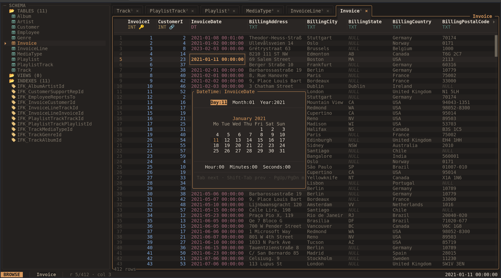

# Edit cells and rows

Edits write directly to the database when confirmed. There is no separate
whole-database Save step. Use a disposable copy when experimenting with changes.

## Edit a cell

Focus a cell and press `Enter`. sqview chooses an editor for the column and
value: text, a value list, a date or datetime picker, or a foreign-key picker.
Press `e` to edit the value directly as text instead. Popup footers show the
available controls.

In the text editor, `Enter` saves, `Alt-Enter` inserts a newline where supported,
and `Esc` cancels. In a value list or foreign-key picker, type to search,
select an entry, and press `Enter` to confirm.

*The datetime picker exposes the date and time of the focused cell.*

In the date picker, `Tab` moves between fields and `PgUp`/`PgDn` change month.
`Enter` saves and `Esc` cancels. Press `n` in the grid to set a cell to SQL `NULL`;
this differs from an empty string. Database constraints may reject a value.

## Insert a row

Press `i` or `Insert` to stage a new row below the current position. Type values
in its fields. `Enter`, `Tab`, or `↓` moves to the next field; `Shift-Tab` or `↑`
moves to the previous field. `Shift-Delete` resets the current field to untouched.

Untouched fields use the database's default or automatic value where available.
Generated columns are displayed but cannot be filled in. Press `Alt-Enter` to
commit the row, or `Esc` to discard it. Once inserted, the row's database order
is determined by your current sort and filters.

## Delete rows

`d` or `Delete` deletes the focused row, or the selected rows when a selection
exists. Review the confirmation and press `y` to proceed; `n` or `Esc` cancels.
`Ctrl-A` selects all rows in the current filtered view, including rows beyond
the visible page. Check the scope before confirming.

## Undo a write

`Ctrl-Z` or **Undo last write** reverses recorded cell updates, row inserts, and
row deletions during the current session. The history holds up to 100 recorded
operations and is lost when you quit. It does not cover SQL console statements.
Constraints or external database changes can prevent an undo from succeeding.

## Read-only behavior

`--readonly` disables database writes and cannot be switched off inside that
session. Restart without the flag to edit. For a database opened writable,
**Toggle read-only** in the command palette switches the application's write
mode; the status bar shows the current mode.

SQLite views and tables without a usable rowid are read-only in the grid.
Generated columns are also read-only. The [SQL console](sql-console.md) is a
separate route for supported SQL writes when the session allows them.
