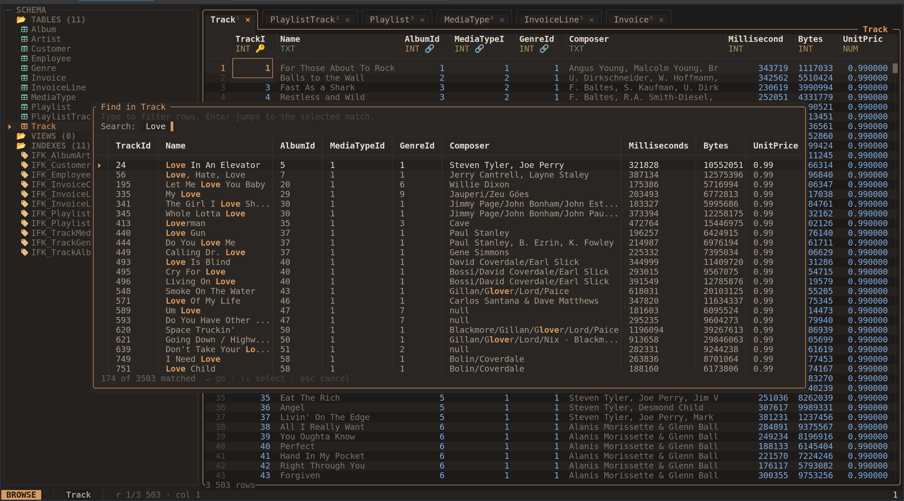

# sqview User Guide

sqview is a keyboard-first terminal application for browsing and editing SQLite
databases. Open tables in tabs, narrow results with filters, follow foreign keys,
inspect records, and export the rows you need.

The GitHub repository is named **sqv**; the installed command and Debian package
are named **sqview**.

[](assets/screenshots/find.png)

*Find in table shows matching rows while keeping your database workspace open.
Select the screenshot to view it at full size. The screenshots are from the
project README and show a sample music-store database; visual details may vary
with your version and configuration.*

Start with [installation and your first session](getting-started.md). Then choose
a task: [browse](browsing.md), [filter and sort](filtering-and-sorting.md),
[search](search.md), [inspect](inspection.md), [edit](editing.md),
[run SQL](sql-console.md), or [copy and export](copy-and-export.md).

Press `?` inside sqview for help or `Ctrl-P` for the command palette. The palette
lets you search for commands by name and lists available table-opening commands.
Popup footers show the controls for the current task.

For inspection with writes disabled, open your database with:

```bash
sqview path/to/database.db --readonly
```

The guide describes sqview 0.4.0. [Configuration](configuration.md), the
[shortcut reference](shortcuts.md), and [troubleshooting](troubleshooting.md)
cover setup and common questions.
